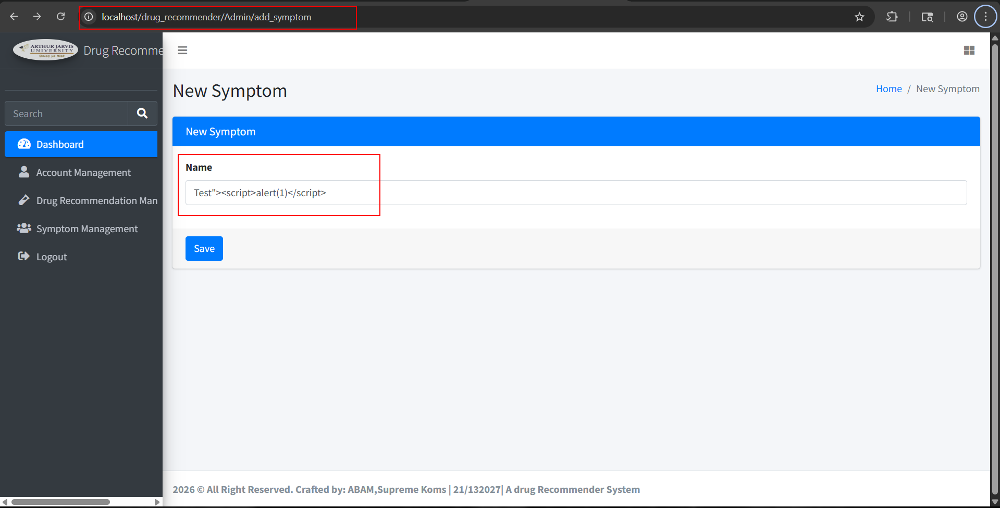
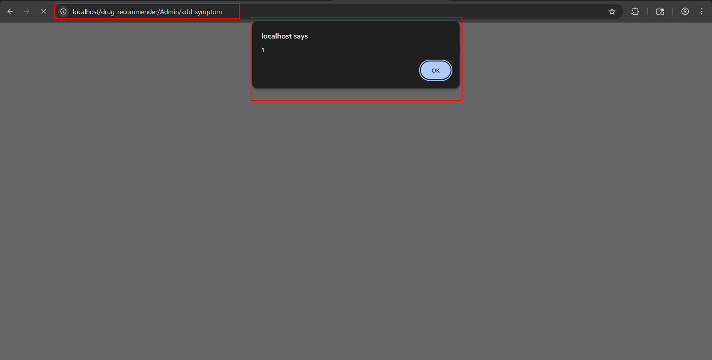
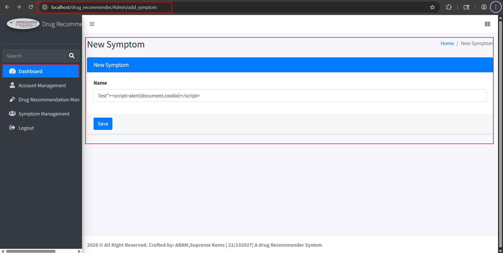
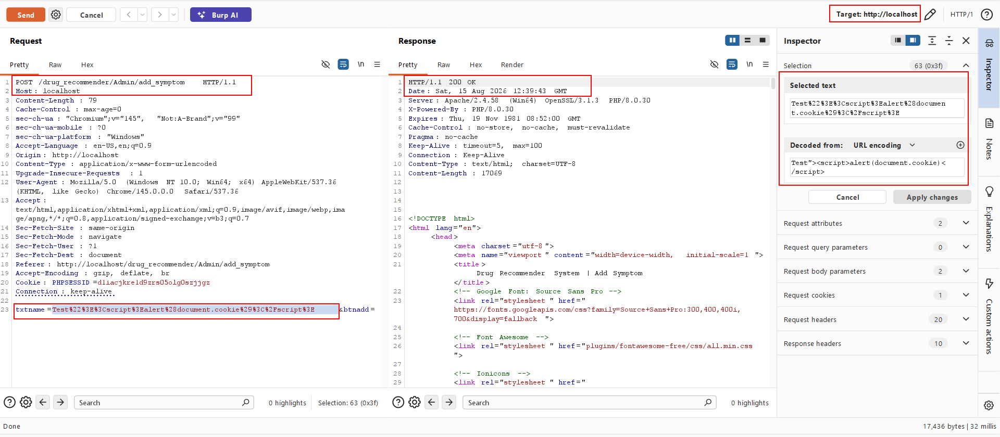
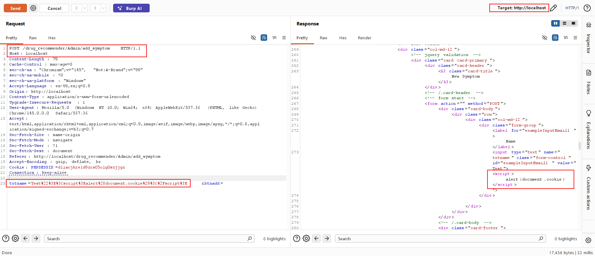
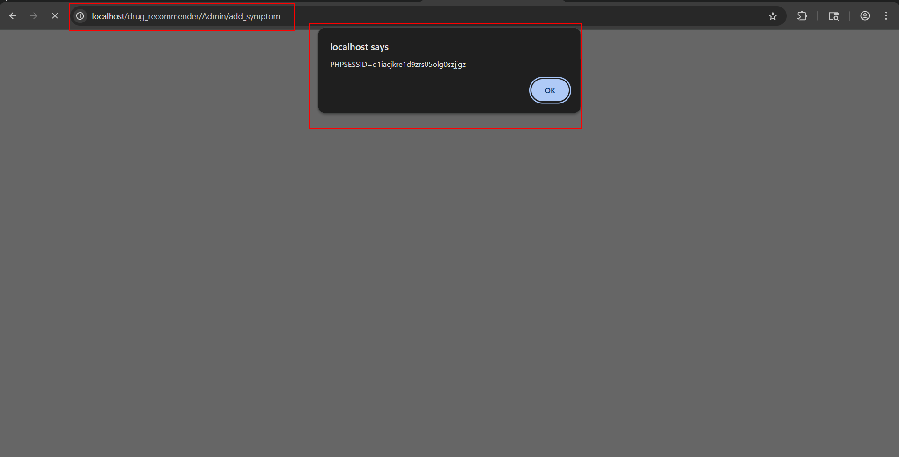

**Title:** **Reflected Cross-Site Scripting (XSS)** at **/drug_recommender/Admin/add_symptom** endpoint in **txtname** parameter

**Severity:** Medium

**CWE:** CWE-79 – Improper Neutralization of Input During Web Page Generation ('Cross-site Scripting')

**Researchers:** Karan Parelkar, Anubhav Verma, Parth Desai

**Source / Vendor:** (Sourcecodester's Drug Recommendation System Using Machine Learning, PHP, and MySQL Database) https://www.sourcecodester.com/php/18278/drug-recommender-web-app-student-project.html

**Summary**

During testing of the open-source Drug Recommendor project, reflected XSS was identified at /drug_recommender/Admin/add_symptom endpoint in txtname parameter . 
User input submitted via POST is reflected back into the server's response without output encoding, inside the value attribute of the corresponding input field. 
The payload uses "> to break out of the attribute and inject a  in the Name field, and click Save. 
The injected script executes.

Repeat with Test"> — the session cookie (PHPSESSID) is displayed, confirming it is exfiltratable.

Burp Suite confirms the raw parameters being reflected verbatim into the response HTML, breaking out of the input value attributes.

The payload not only gets reflected but also stored in the database as if we goto the /drug_recommender/Admin/drug_recommender/symptom_record the document.cookie payload gets executed result in the alert on the screen.

**Impact**

An attacker who induces an authenticated administrator to submit a crafted request (e.g., via a CSRF-style auto-submitting page, as these forms lack CSRF protection) can execute arbitrary JavaScript in the admin's browser context. Because the session cookie lacks the HttpOnly flag, the attacker can read and exfiltrate PHPSESSID via document.cookie, leading to session hijacking, actions performed as the administrator, and access to sensitive application and patient data.

**Remediation**

Apply context-aware output encoding before reflecting any user input into HTML. 

In PHP, encode each value when rendering it back into an attribute:

echo htmlspecialchars($value, ENT_QUOTES, 'UTF-8');

Perform server-side input validation (allow-list expected characters per field).

Set the HttpOnly, Secure, and SameSite flags on session cookies, in php.ini:

session.cookie_httponly = 1

session.cookie_secure = 1

session.cookie_samesite = "Strict"

**Researchers Information**

**Researcher - 1**

Name: Karan Parelkar

Independent Security Researcher

Email: karan.parelkar2005@gmail.com

GitHub: https://github.com/KaranParelkar

LinkedIn: https://www.linkedin.com/in/karan-parelkar-6a370125b/

**Researcher - 2**

Name: Anubhav Verma

Independent Security Researcher

Email: avdzav10@gmail.com

GitHub: https://github.com/anubhavv106

LinkedIn: https://www.linkedin.com/in/anubhav-verma-7123a1232/

**Researcher - 3**

Name: Parth Desai

Independent Security Researcher

Email: ppdesai3@asu.edu

GitHub: https://github.com/ParthD31

LinkedIn: https://www.linkedin.com/in/parth-desai-801951224/
