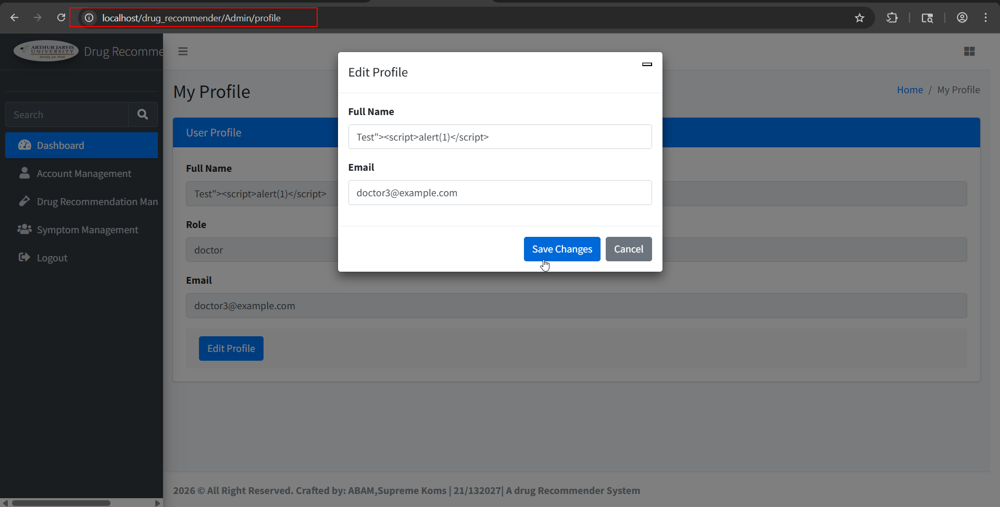
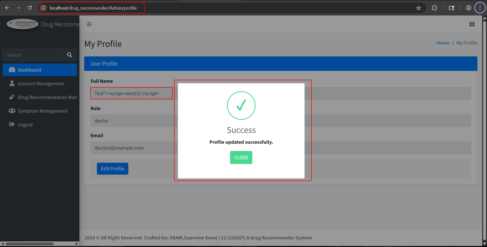
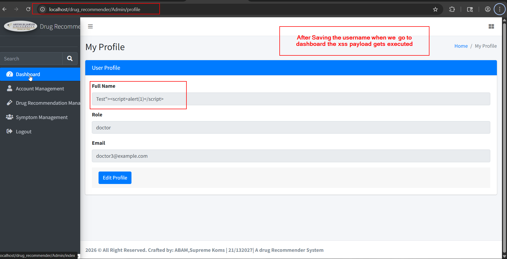
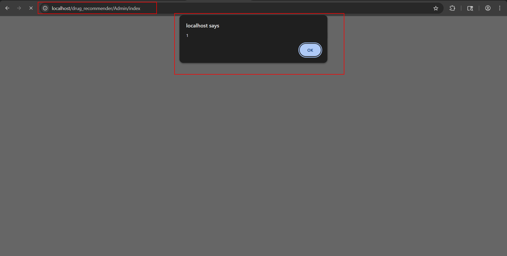

**Title:** Stored Cross-Site Scripting (XSS) in /drug_recommender/profile via the username parameter leading to script execution on /drug_recommender/index.php

**Severity:** Medium

**CWE:** CWE-79 – Improper Neutralization of Input During Web Page Generation ('Cross-site Scripting')

**Vulnerability Type:** Stored Cross-Site Scripting

**Researchers:** Karan Parelkar, Anubhav Verma, Parth Desai

**Source / Vendor:** Sourcecodester's Drug Recommendation System Using Machine Learning, PHP, and MySQL Database

**Source:** https://www.sourcecodester.com/php/18278/drug-recommender-web-app-student-project.html

**Summary**

During security testing of the open-source Drug Recommendation System, a stored cross-site scripting (XSS) vulnerability was identified in the /drug_recommender/profile functionality through the full name parameter (input). User-controlled full name input is stored by the application without adequate output encoding or sanitization. When the affected full name is subsequently rendered on the application's dashboard at /drug_recommender/index.php, the stored malicious payload is interpreted as HTML/JavaScript and executed in the context of the user's browser session.

Unlike reflected XSS, the payload does not need to be supplied again when the vulnerable page is accessed. Once stored in the application's database, the malicious input is automatically rendered and executed whenever the affected username is displayed on the dashboard. This demonstrates a persistent XSS condition that can affect users who access the vulnerable dashboard.

**Affected Endpoint and Parameter**

**Profile endpoint:** /drug_recommender/profile

**Affected parameter:** full name

**Affected rendering endpoint:** /drug_recommender/index.php

**Vulnerability:** Stored/Persistent Cross-Site Scripting (XSS)

**Steps to Reproduce**

1. Authenticate to the application and navigate to the /drug_recommender/profile page.
   
   
   
2. Enter a crafted XSS payload in the username field.

   
3. Save/update the profile.

The application stores the supplied username in the database without sufficient output encoding.

4. Navigate to /drug_recommender/index.php.

 
 

5. The injected JavaScript executes automatically when the username is displayed.

 
 
The stored username is rendered on the dashboard.

 

The vulnerability can be verified by observing that the payload executes on /drug_recommender/index.php without requiring the payload to be submitted again.

**Technical Details**

The root cause is the application's failure to properly neutralize user-controlled username data before rendering it in the HTML response. The username is accepted and persisted by the /profile functionality and is later retrieved and rendered on /index.php without appropriate context-aware output encoding.

Because the malicious value is stored server-side, the resulting vulnerability is classified as stored/persistent XSS. Any user who accesses a page where the affected username is rendered may have the injected JavaScript executed within their browser context.

**Impact**

An attacker capable of storing a malicious username can execute arbitrary JavaScript in the browser context of users who subsequently access the affected dashboard. Depending on the privileges and information available to the victim's session, exploitation could allow unauthorized actions within the application, manipulation of displayed content, access to data available to the victim's browser context, or execution of further client-side attacks.

The impact may be particularly significant if the affected username is displayed to privileged users such as administrators.

**Remediation**

The application should apply context-aware output encoding whenever user-controlled username values are rendered into HTML.

For PHP applications, values rendered into HTML should be encoded using an appropriate function such as:

echo htmlspecialchars($username, ENT_QUOTES, 'UTF-8');

Server-side validation should also be implemented using an allow-list appropriate for usernames. Input validation should be treated as an additional defense and not as a replacement for output encoding.

Where applicable, a Content Security Policy (CSP) should also be implemented to reduce the impact of successful XSS exploitation.

**CVSS v3.1**

**Recommended Base Score: 6.1 (Medium)**

**Vector: CVSS:3.1/AV:N/AC:L/PR:N/UI:R/S:C/C:L/I:L/A:N**

**Researchers Information**

**Researcher 1**

Name: Karan Parelkar
Role: Independent Security Researcher
Email: karan.parelkar2005@gmail.com
GitHub: https://github.com/KaranParelkar
LinkedIn: https://www.linkedin.com/in/karan-parelkar-6a370125b/

**Researcher 2**

Name: Anubhav Verma
Role: Independent Security Researcher
Email: avdzav10@gmail.com
GitHub: https://github.com/anubhavv106
LinkedIn: https://www.linkedin.com/in/anubhav-verma-7123a1232/

**Researcher 3**

Name: Parth Desai
Role: Independent Security Researcher
Email: ppdesai3@asu.edu
GitHub: https://github.com/ParthD31
LinkedIn: https://www.linkedin.com/in/parth-desai-801951224/
